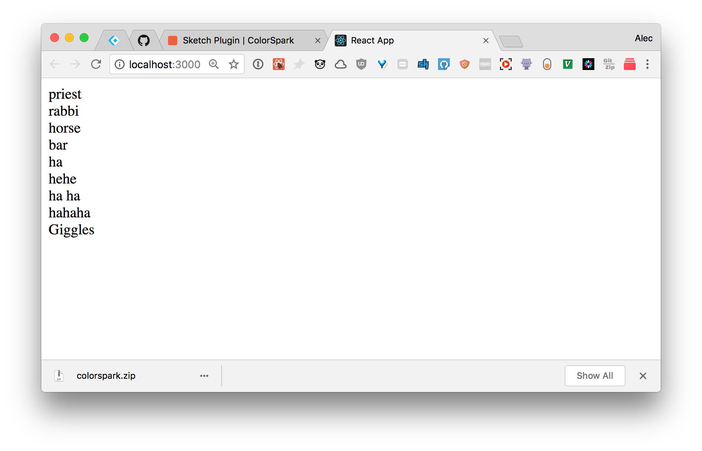
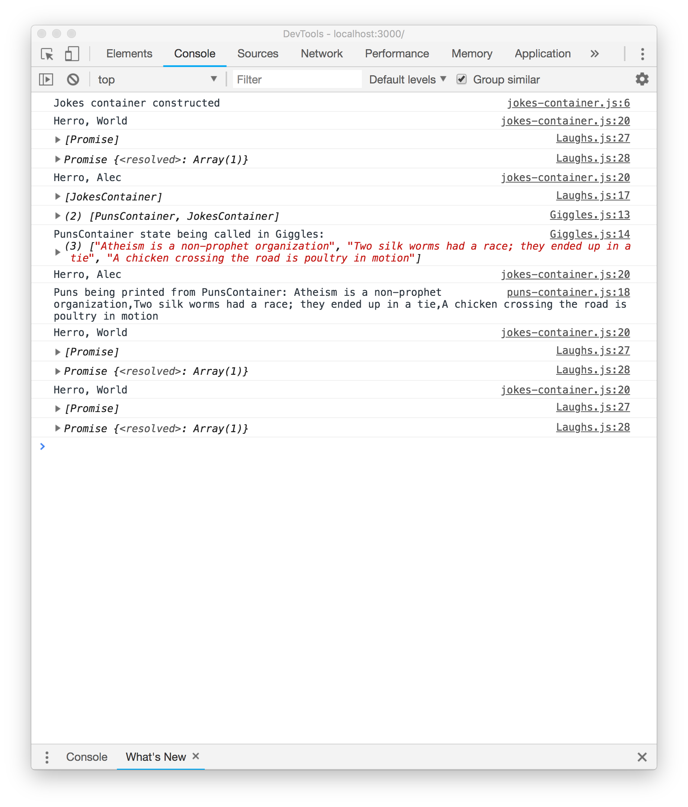

# Unstated-Connect Create-React-App Sandbox

**Purpose**
Better understand the limitations of [unstated](https://github.com/jamiebuilds/unstated) and implementation details of [unstated-connect](https://github.com/goncy/unstated-connect)

**Output**

**Libraries**
[unstated]
